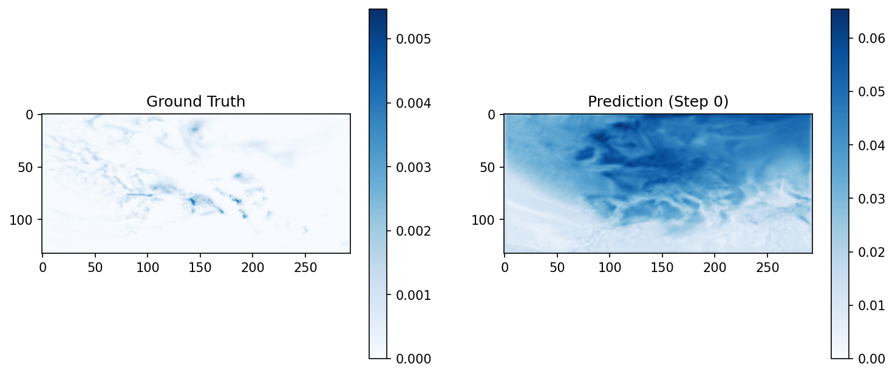
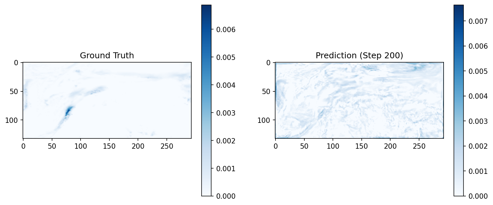
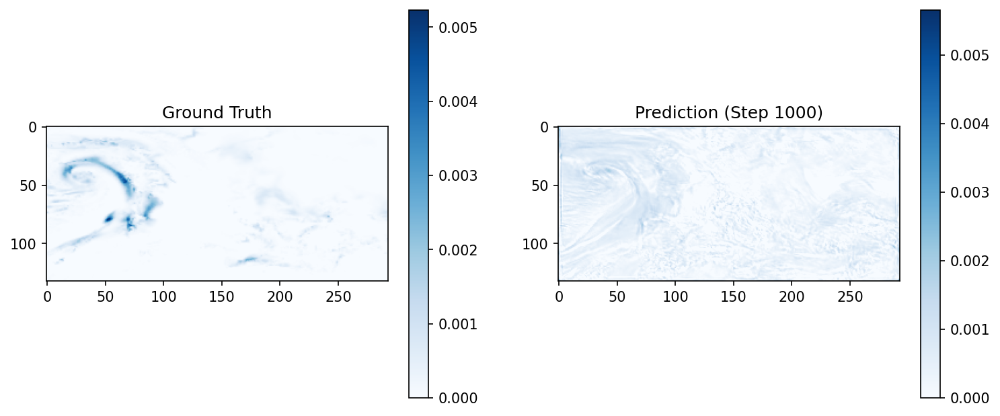
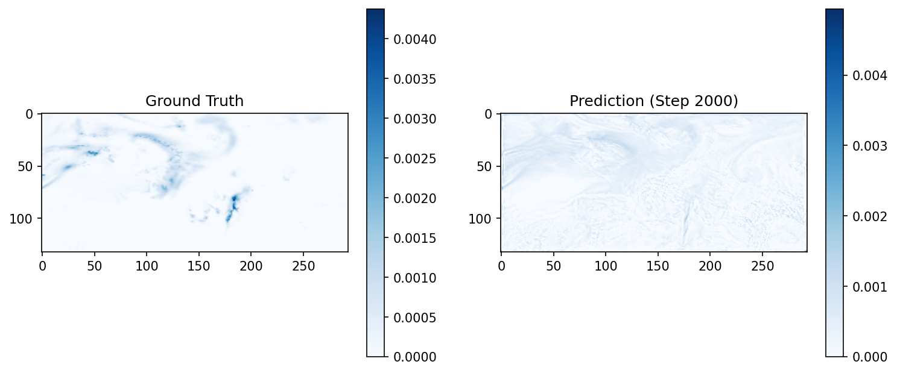
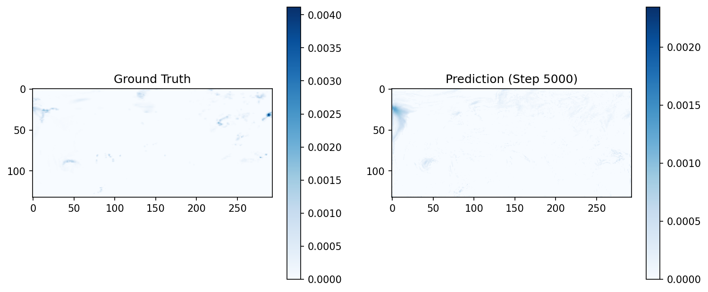
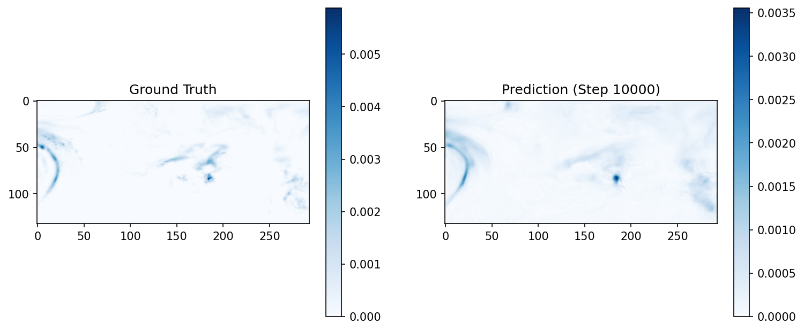
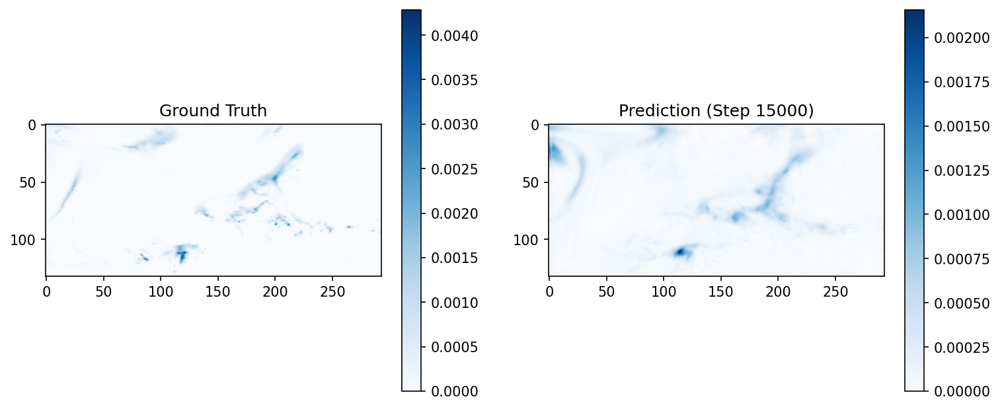

from pathlib import Path

readme_content = """
# 🌦️ ERA5 Weather Forecasting with Deep Learning

This project focuses on building a machine learning pipeline using ERA5 reanalysis data to predict **total precipitation** based on various atmospheric variables. The data is processed, visualized, and loaded into PyTorch models using a custom `Dataset` class.

---

## 🔍 Objectives

- ✅ Train a UNet to predict Total Precipitation given other variables e.g. 2m Temp, MSLP, Cloud Cover, 500HPa Geopotential etc.
- ✅ Visualize the ground truth vs. predicted Precipitation with matplotlib

---

## 🗂️ Data Overview

Data is collected from [ERA5 Reanalysis](https://cds.climate.copernicus.eu/cdsapp#!/home) via the `cdsapi` and split into three categories:

### 🟦 Instantaneous Surface Variables
- `2m_temperature` (t2m)
- `mean_sea_level_pressure` (msl)
- `10m_u_component_of_wind` (u10)
- `10m_v_component_of_wind` (v10)
- `total_cloud_cover` (tcc)

### 🟩 Accumulated Variables
- `total_precipitation` (tp) **(target)**
- `surface_solar_radiation_downwards` (ssrd) *(optional, ignored during model training)*

### 🟨 Pressure Level Variables (850 & 500 hPa)
- `temperature` (t)
- `geopotential` (z)
- `relative_humidity` (r)

---

## 🤖 Model Architecture

This project uses a convolutional neural network (CNN) based **U-Net** architecture for precipitation prediction. The U-Net is designed for spatial data, and is commonly used for image-to-image tasks. Key features include:

- ⚙️ **Encoder-decoder structure** with skip connections
- 📐 Handles multi-channel 2D atmospheric input maps
- 🕸️ Maintains spatial resolution of the target (precipitation) field
- 🧼 Trained with MSE loss and optional regularization

The model takes multiple atmospheric variables as input and learns to predict total precipitation over a given region and time.

## 🧠 Model Input & Output

- **Input (X)**: A stack of all variables (except `tp` and `ssrd`) at a specific `valid_time`, shaped as `(lat, lon, num_features)`
- **Target (Y)**: The `total_precipitation` map for the same `valid_time`, shaped as `(lat, lon)`

---

## 📈 Model Progress Over Time

Below are sample validation outputs from various training steps:

| Step     | Sample Output |
|----------|----------------|
| 0        |  |
| 200      |  |
| 500      |  |
| 1000     |  |
| 2000     |  |
| 5000     |  |
| 10000    |  |
| 15000    |  |

## 🔍 Further Exploration & Visualizations

- 📊 **Training Data Exploration**: For a comprehensive look at the input variables, spatial patterns, and relationships in the ERA5 dataset, check out [`era5-data-exploration-precip.ipynb`](./era5-data-exploration-precip.ipynb).
- 🧪 **Test Data Visualizations**: Final visualizations and model evaluation on unseen test data can be found at the end of [`training.ipynb`](./training.ipynb).

